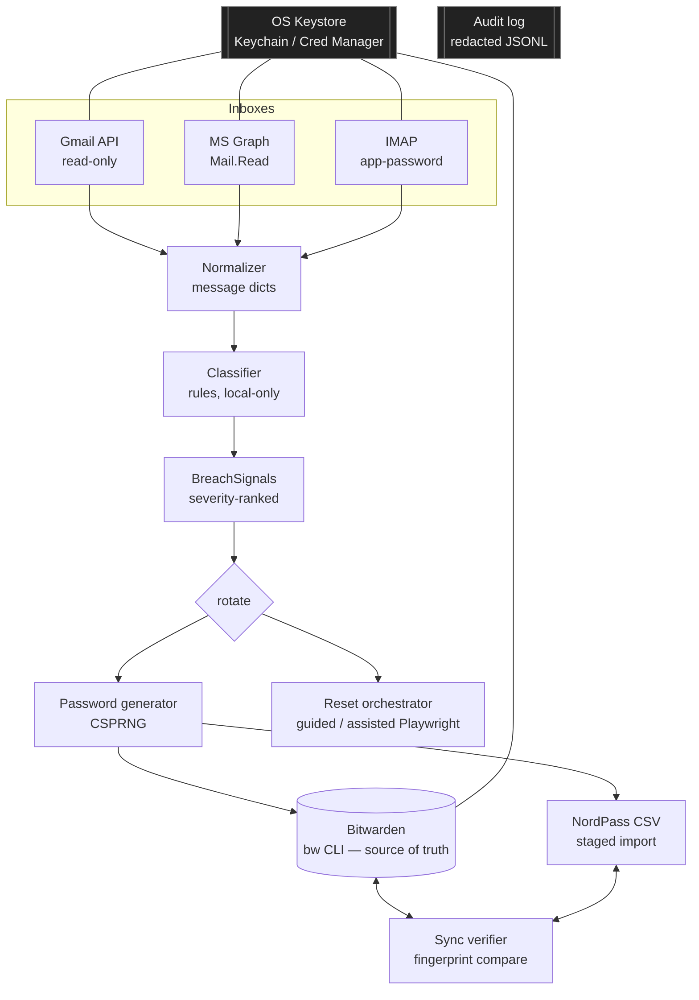

# RPHE — Recovery & Password-Hygiene Engine

A **local-first**, cross-platform (macOS + Windows) tool that:

1. **Scans** your email inbox(es) for breach / compromise signals.
2. **Checks** accounts and passwords against the **Have I Been Pwned** breach
   database (privacy-preserving k-anonymity for passwords; HIBP API for emails).
3. **Guides** (or, optionally, **assists**) the password-reset process for each
   flagged account.
4. **Generates** strong, unique replacements and lets you **pick from 5**
   breach-vetted candidates (CSPRNG).
5. **Writes** the new credentials to **Bitwarden** (automated source of truth)
   and **bridges to NordPass** via CSV import.
6. **Verifies** the two vaults stay consistent and flags drift.
7. **Advises** on enrolling **passkeys** where the service supports them.
8. Ships as a **desktop GUI** plus a CLI — installable as a macOS **`.dmg`** and
   a Windows **`.exe`**.

> ⚠️ **Read [§7 Limitations](#7-limitations--honest-trade-offs) first.** The
> single most important fact: **NordPass has no public write API or official
> CLI.** True silent, real-time, two-way sync with NordPass is *not possible*
> through supported means. RPHE makes Bitwarden the automated source of truth
> and mirrors to NordPass through its supported CSV import. Anyone promising
> seamless NordPass API sync is either scraping (fragile/ToS-risky) or making
> it up.

> 🔒 **What this tool will never do:** ask you to send your passwords or master
> credentials to anyone (including in chat). Secrets are entered only through
> local hidden prompts and go straight into your OS keychain — they never reach
> a server or a third party. A **passkey** is a per-website cryptographic key
> created and held by your phone/device or Bitwarden; this tool *advises* you to
> enrol passkeys but never creates, stores, or transmits one. There is also no
> way to "scan the web" to discover unknown accounts — RPHE works from your
> email, your vaults, and breach databases.

## Desktop app & installers

RPHE ships as a minimal **desktop GUI** (Tkinter — bundles cleanly, zero extra
deps) over the same engine the CLI uses, so both behave identically.

- **macOS `.dmg`** — built locally with `PYBIN=/Library/Frameworks/Python.framework/Versions/3.13/bin/python3 ./packaging/build_macos.sh` → `dist/RPHE.dmg` (drag to Applications).
- **Windows `.exe`** — PyInstaller can't cross-compile, so it's built on Windows
  (`packaging/build_windows.ps1`) **or** automatically by GitHub Actions.
- **CI (`.github/workflows/build-installers.yml`)** builds **both** on native
  runners and attaches them to the GitHub Release when you push a `vX.Y.Z` tag.
  Trigger: `git tag v0.2.0 && git push origin v0.2.0`, or run the workflow
  manually (**Actions → Build installers → Run workflow**) to get artifacts.

> The GUI needs a **Tk-enabled Python** (the python.org installer includes it;
> Homebrew Python may not — use the python.org build to package). The CLI needs
> no GUI libraries.

---

## 1. Architecture & approach

### Why Python + a CLI

| Decision | Why |
|---|---|
| **Python 3.11+** | One codebase, both OSes. The only OS-specific concern — secure storage — is abstracted by the `keyring` library (Keychain on macOS, Credential Manager on Windows). Mature libraries exist for IMAP (stdlib), Gmail API, MS Graph, and Playwright. |
| **CLI (Typer + Rich)** over Electron/Tauri/PyQt | A CLI gives *byte-identical* behavior on macOS and Windows with zero native-UI divergence, the smallest attack surface, and the easiest auditability for a security tool. (A Textual TUI or Tauri GUI can wrap this same core later — the logic is UI-agnostic.) |
| **Bitwarden `bw` CLI** | First-party, cross-platform, stable JSON interface. Officially supported automation. |
| **NordPass = CSV bridge** | The only first-party, supported programmatic path (see §7). |

### High-level data flow



### Email scanning: which approach and why

| Method | Use when | Pros | Cons |
|---|---|---|---|
| **Gmail API** (recommended for Gmail) | provider `gmail` | `gmail.readonly` scope = read-only by design; server-side search; revocable per-app token; no app password | one-time Google Cloud OAuth client setup |
| **Microsoft Graph** (recommended for Outlook/365) | provider `graph` | `Mail.Read` delegated scope; server-side `$filter`; revocable | one-time Entra app registration |
| **IMAP** (universal fallback) | provider `imap` | works everywhere, pure stdlib, no cloud project | needs an **app password** (full-mailbox read — coarser); Gmail/MS require app password or OAuth for IMAP |
| **`.eml` files** (offline) | provider `eml` | **zero account access** — export suspicious mail and classify locally | manual export; not live |

**Recommendation:** use the **provider API** (Gmail/Graph) where available for
least-privilege read-only tokens; fall back to IMAP for Fastmail/iCloud/self-hosted.
Try `rphe demo` (built-in samples) or the `eml` provider first to see what RPHE
flags before granting any access. **Gmail walkthrough: [docs/GMAIL_SETUP.md](docs/GMAIL_SETUP.md).**

### Bitwarden integration

Via the official **`bw` CLI** invoked as a subprocess. The master password is
piped over **STDIN** (never argv, which `ps` can read); the returned session key
is cached in the OS keystore and passed via `BW_SESSION`. Item payloads are
base64-JSON over STDIN. After each write we run `bw sync` so other devices
converge. Writes are **verified** by reading the item back.

### NordPass integration & sync

NordPass receives credentials via a generated, NordPass-column CSV that you
import (Settings → Import → CSV). The **sync verifier** compares Bitwarden and
the staged CSV by logical identity (`name|username|host`) and by a password
**fingerprint** (`sha256[:8]` — equality only, never plaintext), reporting:
items only in one vault, and password drift. See §7 for why this is a bridge,
not real-time sync.

---

## 2. Security design

- **Secrets at rest:** email OAuth tokens, IMAP app-passwords, the Bitwarden
  session key, and provider client secrets live **only** in the OS keystore via
  `keyring` (macOS Keychain / Windows Credential Manager). The YAML config holds
  **no secrets** — only *references* to keystore keys.
- **Plaintext passwords are never logged or persisted** by design:
  - `GeneratedCredential.secret` has `repr=False` so it can't leak via `print`.
  - The audit layer only ever serializes `.to_safe_dict()` (length + sha256
    fingerprint) and runs a regex redaction pass on every line.
  - Reset links / tokens are reduced to their **host** before logging.
- **The one unavoidable plaintext window** is the NordPass CSV during import
  (inherent to *any* CSV import). It is written `0600`, staged in app-data, and
  `rphe nordpass clean` overwrites-then-deletes it. Import promptly, then clean.
- **2FA / MFA:** RPHE **never** tries to defeat MFA. The reset orchestrator
  treats CAPTCHA, email codes, and "was this you?" prompts as **human-only**
  steps and pauses for you. After a reset it reminds you to review active
  sessions and (re)enable MFA.
- **Audit trail:** append-only JSONL (`audit.log.jsonl`, `0600`) records *what
  happened* — scans, which services were flagged (host-only), vault writes
  (fingerprint-only), reset plans, sync results. It **never** records passwords,
  tokens, full reset URLs, or message bodies with tokens.

### Threat model

**Protects against:** missing a breach/compromise alert buried in your inbox;
password reuse (every rotation is unique, high-entropy); credential drift
between your two managers; accidental secret leakage into logs/config/argv.

**Does *not* protect against:** a compromised host (a keylogger/malware on your
machine can read anything you type, including master passwords — RPHE assumes a
trusted endpoint); a phished master password; a malicious/forged "reset" email
(RPHE shows the sender host and makes link-trust a human checkpoint, but **you**
must verify legitimacy before acting); provider account-level takeover that has
already changed your recovery options.

---

## 3. Core features

| Module | File | What it does |
|---|---|---|
| Email scanners | `rphe/scanners/{imap,gmail,graph,eml}_scanner.py` | Read-only fetch → normalized message dicts (`eml` = offline files) |
| Classifier | `rphe/classifier.py` | Rule-based; emits severity-ranked `BreachSignal`s, extracts reset links |
| Breach checker | `rphe/breach.py` | HIBP: free k-anonymity password check + (keyed) email-breach lookup |
| Password generator | `rphe/passwords.py` | CSPRNG, class guarantees, passphrase mode, **5 breach-vetted candidates** |
| Engine | `rphe/engine.py` | Shared headless service the CLI **and** GUI both call (parity) |
| Vault writer (Bitwarden) | `rphe/vaults/bitwarden.py` | `bw` CLI upsert + read-back verify + `bw sync` |
| Vault bridge (NordPass) | `rphe/vaults/nordpass.py` | NordPass-column CSV upsert + secure clean |
| Sync verifier | `rphe/vaults/sync.py` | Fingerprint drift report |
| Reset orchestrator | `rphe/reset/orchestrator.py` | Guided steps; optional Playwright **assisted** reset (never auto-submits) |
| Passkey advisor | `rphe/passkeys.py` | Detects passkey-capable services, gives enrolment steps (never holds a passkey) |
| Desktop GUI | `rphe/gui.py` | Tkinter window: scan, breach report, pick-from-5, rotate, sync |
| Secure storage | `rphe/secrets.py` | `keyring` wrapper |
| Audit log | `rphe/audit.py` | Redacted append-only JSONL |
| CLI | `rphe/cli.py` | Identical UX on macOS + Windows |

---

## 4. Setup

### Prerequisites (both OSes)
- Python **3.11+**
- Bitwarden CLI **`bw`** (only needed for vault writes)
- Node 18+ (only if you install `bw` via npm)

### macOS

```bash
# 1. Get the code and a virtualenv
cd ~/Desktop/RPHE
python3 -m venv .venv && source .venv/bin/activate

# 2. Install (core + the extras you need)
pip install -e ".[all]"          # or: pip install -r requirements.txt
python -m playwright install chromium   # only for `rotate --automate`

# 3. Bitwarden CLI
brew install bitwarden-cli
bw login                          # one-time; or `bw login --apikey`

# 4. Initialize config
rphe init                         # writes ~/.config/rphe/config.yaml — edit it
```

### Windows (PowerShell)

```powershell
cd $env:USERPROFILE\Desktop\RPHE
py -m venv .venv; .\.venv\Scripts\Activate.ps1

pip install -e ".[all]"          # or: pip install -r requirements.txt
python -m playwright install chromium

winget install Bitwarden.CLI     # or: npm install -g @bitwarden/cli
bw login

rphe init                        # writes %APPDATA%\rphe\config.yaml — edit it
```

Everything after setup (`scan`, `rotate`, `sync verify`, …) is **identical** on
both platforms.

### Obtaining credentials

- **Gmail API:** full step-by-step (with the test-user + verification gotchas)
  is in **[docs/GMAIL_SETUP.md](docs/GMAIL_SETUP.md)**. Short version: Cloud
  Console → enable Gmail API → OAuth consent screen (External, add yourself as a
  Test user) → Credentials → **OAuth client ID → Desktop app** → download JSON →
  `rphe auth gmail personal-gmail /path/to/client_secret.json` (auto self-checks).
- **Microsoft Graph:** Entra ID → App registrations → New → add **delegated**
  `Mail.Read` → Authentication → enable "Allow public client flows". Copy the
  **Application (client) ID**. Then: `rphe auth graph work-outlook <client_id>`.
- **IMAP app password:** create one in your provider's security settings, then
  `rphe secrets set imap.<label>.app_password`.
- **Bitwarden:** `bw login` (interactive) or `bw login --apikey` (set
  `BW_CLIENTID`/`BW_CLIENTSECRET`). `rphe vault unlock` caches the session.
- **NordPass:** no credentials needed — it's a manual CSV import.
- **Have I Been Pwned (optional):** the free password k-anonymity check needs no
  key. To enable **email**-breach lookups, buy a key at
  <https://haveibeenpwned.com/API/Key> and run `rphe secrets set hibp.api_key`.

---

## 5. Running, testing, uninstalling

```bash
rphe gui                          # launch the desktop GUI (same engine as CLI)
rphe demo                         # classifier on built-in samples (zero setup)
rphe auth gmail-check personal-gmail   # validate a stored Gmail token
rphe secrets set hibp.api_key     # (optional) enable email-breach lookups
rphe breach                       # check inbox addresses against Have I Been Pwned
rphe scan --dry-run               # fetch + classify, write nothing
rphe scan                         # list at-risk accounts
rphe rotate --min-severity HIGH   # pick-from-5 rotation of HIGH+ findings
rphe rotate --automate            # assisted browser (still pauses for you)
rphe sync verify                  # Bitwarden vs NordPass CSV drift
rphe nordpass instructions        # how to import the staged CSV
rphe nordpass clean               # shred the staged CSV after importing
rphe audit                        # redacted event log

pytest -q                         # run the test suite
```

**Uninstall:**
```bash
pip uninstall rphe
rphe secrets del bitwarden.session     # repeat for any stored secret, OR
# remove all "rphe" entries from Keychain Access (macOS) /
# Credential Manager (Windows)
rm -rf ~/.config/rphe ~/.local/share/rphe        # macOS/Linux
# Windows: rmdir /s %APPDATA%\rphe %LOCALAPPDATA%\rphe
```

---

## 6. Project structure

```
RPHE/
├── README.md                     # this file
├── requirements.txt              # pinned deps (core required, rest optional)
├── pyproject.toml                # packaging + `rphe` console script
├── config.example.yaml           # starter config (no secrets)
├── .gitignore                    # blocks csv/tokens/config/build artifacts from VCS
├── docs/
│   └── GMAIL_SETUP.md            # end-to-end Gmail OAuth runbook + troubleshooting
├── .github/workflows/
│   └── build-installers.yml      # CI: build .dmg (macOS) + .exe (Windows)
├── packaging/
│   ├── rphe_launch.py            # frozen-app entry point (+ headless self-test)
│   ├── rphe_gui.spec             # PyInstaller spec (.app on macOS, .exe on Windows)
│   ├── build_macos.sh            # build RPHE.app → RPHE.dmg
│   └── build_windows.ps1         # build RPHE.exe
├── rphe/
│   ├── __init__.py               # package metadata
│   ├── __main__.py               # `python -m rphe`
│   ├── cli.py                    # Typer CLI — all commands (incl. gui, breach)
│   ├── gui.py                    # Tkinter desktop GUI
│   ├── engine.py                 # shared headless service (CLI + GUI parity)
│   ├── config.py                 # YAML config + cross-platform paths
│   ├── models.py                 # typed domain models (+ redaction-safe views)
│   ├── secrets.py                # keyring wrapper (Keychain / Cred Manager)
│   ├── audit.py                  # redacted append-only JSONL log
│   ├── passwords.py              # CSPRNG generator + 5-candidate picker
│   ├── breach.py                 # Have I Been Pwned integration
│   ├── passkeys.py               # passkey enrolment advisor
│   ├── classifier.py             # rule-based breach-signal classifier
│   ├── samples.py                # synthetic emails for `rphe demo`
│   ├── scanners/
│   │   ├── __init__.py           # scanner factory
│   │   ├── base.py               # Scanner ABC + shared MIME/HTML→text helpers
│   │   ├── imap_scanner.py       # IMAP (stdlib, universal)
│   │   ├── gmail_scanner.py      # Gmail API (read-only) + token self-check
│   │   ├── graph_scanner.py      # Microsoft Graph (Mail.Read)
│   │   └── eml_scanner.py        # offline .eml folder scanner (no account access)
│   ├── reset/
│   │   ├── __init__.py
│   │   └── orchestrator.py       # guided + assisted (Playwright) resets
│   └── vaults/
│       ├── __init__.py
│       ├── base.py               # VaultWriter ABC + VaultError
│       ├── bitwarden.py          # bw CLI integration (source of truth)
│       ├── nordpass.py           # CSV bridge + secure clean
│       └── sync.py               # fingerprint drift verifier
└── tests/
    ├── test_passwords.py         # generator guarantees + entropy
    ├── test_classifier.py        # classification + redaction
    ├── test_gmail_decode.py      # offline Gmail MIME/base64url decode
    ├── test_eml_scanner.py       # .eml folder scan → classify pipeline
    ├── test_samples.py           # demo corpus regression guard
    ├── test_breach.py            # HIBP k-anonymity + email lookup (offline)
    └── test_candidates_passkeys.py  # 5-password picker + passkey advisor
```

---

## 7. Limitations & honest trade-offs

### NordPass has no programmatic write API
There is **no public NordPass developer API and no official NordPass CLI for
personal vault writes.** Supported ingest paths are: (1) **CSV import**, (2)
in-app "import from Bitwarden". Therefore:
- RPHE cannot push to NordPass silently or in real time.
- "Sync" is **Bitwarden → CSV → you click Import**. The verifier detects drift
  but cannot *fix* NordPass automatically.
- Alternatives we deliberately **rejected**: browser-extension UI automation
  (breaks on every UI change, brittle, against the spirit of ToS) and
  private-API reverse engineering (unsupported, may violate ToS, risks locking
  your account). If you accept those risks, they can be added behind an explicit
  opt-in flag — but they are not in this build.

### Automated resets are intentionally limited
- Reset links are **single-use** — a botched automation can burn the link and
  lock you out. RPHE defaults to **guided** mode and, even in `--automate`,
  only pre-fills password fields and **pauses for you** to handle CAPTCHA/MFA
  and click the final submit. It never blind-submits.
- CAPTCHA and MFA are *designed* to stop bots — RPHE respects that.
- High-stakes domains (Google, Apple, Microsoft, banks, PayPal, exchanges) are
  on a **never-automate** list and are always guided-only.
- Selector-based automation is fragile across site redesigns; that's why the
  human stays in the loop.

### Risks of automating rotations, and mitigations
| Risk | Mitigation |
|---|---|
| Lockout from a burned reset link | Guided-first; assisted mode pauses, never auto-submits |
| Acting on a phishing "breach" email | Sender host shown; human link-trust checkpoint; never auto-clicks links |
| Plaintext exposure via CSV | `0600` perms, atomic write, `nordpass clean` shred, import-then-delete |
| Secret leakage to logs/argv | `repr=False`, fingerprint-only audit, redaction pass, STDIN not argv |
| Stale Bitwarden session | Session validated each run; re-unlock on failure |

### Alternatives to consider before building on this
- **Pick one password manager.** Maintaining two vaults in sync is the root of
  most of this complexity. Bitwarden alone (with its native breach report and
  Have I Been Pwned integration) covers most of the goal with far less risk.
- **Use [Have I Been Pwned](https://haveibeenpwned.com/) + provider security
  dashboards** for breach detection instead of email heuristics — more reliable
  than classifying alert emails.
- **Bitwarden's built-in "Data Breach Report" / weak-and-reused-password
  reports** already surface most at-risk credentials.

Treat RPHE as a power-user convenience layer over those, not a replacement for
provider-native security.

---

## License
MIT. Provided as-is; you are responsible for how you use it against your own
accounts. Review the code before trusting it with your credentials.
